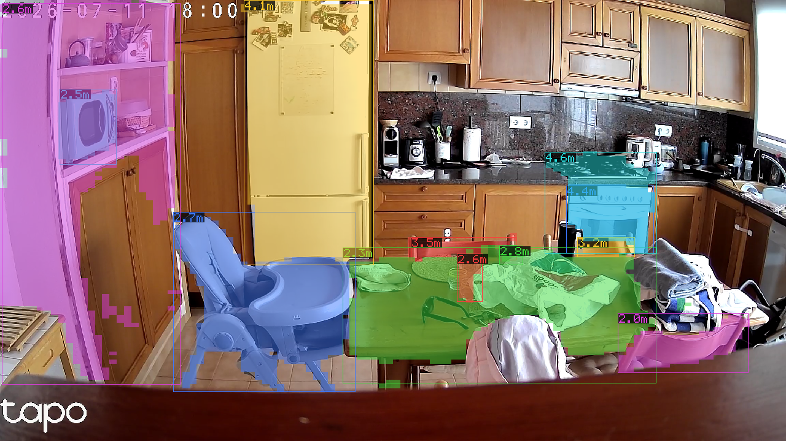
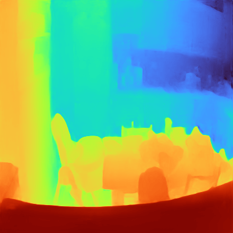

# vrt-depth-anything

**Detection + metric depth in one GPU pass.** Run an instance segmenter and
**Depth Anything V2 metric** depth on the **same image, one shared CUDA stream, one
sync** — then read a **metric depth (meters) per detected object**, sampled from its
instance **mask** (not the box, so no background bleed). Part of the
[`vision-rt`](https://github.com/kornia/vision-rt) workspace.



*Live kitchen RTSP: each object masked, boxed, and labelled with its metric depth.
The dense depth map that feeds the per-object sampling (Turbo, near = warm):*



```rust
// Detector + metric depth share ONE stream and the SAME image. Each submit only
// enqueues; ONE synchronize() drains both; then per-object depth from the mask.
let stream = vrt::Stream::new_standalone()?.cuda_stream().clone();
let mut det   = RfDetrSeg::from_engine_file(seg_engine,     stream.clone(), 0.4)?;
let mut depth = DepthAnything::from_engine_file(depth_engine, stream.clone())?;
let (mut d, mut z) = (det.alloc_result()?, depth.alloc_result()?);

det.submit(&img, &mut d)?;      // enqueue: seg  → boxes + masks  (no sync)
depth.submit(&img, &mut z)?;    // enqueue: DA2  → metric depth   (no sync)
let zs = z.depth_image()        // depth-at-mask sampling is a builtin on DepthImage
    .sample_masks(d.masks_slice(), d.mask_size(), &stream)?;
stream.synchronize()?;          // ONE sync drains seg + depth + fusion

for (inst, z_m) in d.instances()?.iter().zip(stream.clone_dtoh(&zs)?) {
    // inst = class + box + mask ;  z_m = metric depth in meters, inside the mask
    println!("class {} @ {z_m:.2} m", inst.class_id);
}
```

Depth-at-mask / -box sampling are **builtins on `DepthImage`** (`sample_masks` /
`sample_boxes`, plus `Mask::sample_depth` for a single mask) — the typed device
image owns the op. Feed the sampled `z` straight to a tracker's `Detection::depth`.

## Depth on its own

`DepthAnything` is `Image<u8,3> → DepthImage` (dense metric depth, meters).
GPU-resident + async / caller-owned like the detector crates:

```rust
let mut depth = DepthAnything::from_engine_file(engine, stream.clone())?;
let mut out = depth.alloc_result()?;
depth.submit(&image, &mut out)?;        // enqueue, no sync
stream.synchronize()?;
let map = out.depth_host()?;            // DepthImage (meters), on demand
// or stay on device: out.depth_image() / out.depth_slice()
```

Model: Depth Anything V2 Metric-Small (indoor/Hypersim) export — input `[1,3,S,S]`
(S multiple of 14), output `depth [1,S,S]` metric meters (~20 m indoor range). The
map spans the whole stretched frame, so box/mask coords scale to the map by
`map/src`. **Ships at S=392** (the speed/accuracy sweet spot — see Benchmark); the
crate reads S from the engine, so a 518 build works unchanged. Model credit to the
upstream authors.

## Benchmark

Jetson Orin (MAXN_SUPER, fp16, `trtexec` engine-only GPU compute):

| Input | GPU compute | Throughput | Note |
|-------|-------------|-----------:|------|
| **392×392** (shipped) | **10.1 ms** | **~98 fps** | fast; ~1.77× quicker than 518 |
| 518×518 (native) | 17.9 ms | ~56 fps | max accuracy |

The GPU **fusion kernels** (`sample_masks` / `sample_boxes`) are negligible next to
the engine — a per-instance masked reduction over ~200 slots. Verified end-to-end
(`detect_depth` on a COCO image): RF-DETR-Seg + DA2 + mask-sampling all complete in
**one** `synchronize()`, per-instance metric depth physically plausible (cats/remotes
on a couch ≈ 1.7–2.0 m). fp16 is numerically clean on this export (no norm-layer
overflow → no fp32 pinning needed). Run depth at **lower cadence** and let a tracker
coast between updates if you need to spend less GPU per frame.

### Live pipeline (detect + depth)

The full `RfDetrSeg` + `DepthAnything` loop of the hero snippet, measured live on a
1280×720 kitchen RTSP stream (`examples/rtsp_depth`), steady-state over 800 frames,
depth at S=392, MAXN_SUPER / fp16:

| Stage | ms |
|-------|----:|
| preproc + enqueue (both `submit`s) | 4.2 |
| fusion (`sample_masks`, depth-at-mask) | 0.03 |
| GPU sync (seg + depth + fusion) | 25.9 |
| readout (per-instance depth D2H + count) | 0.07 |
| **compute end-to-end** | **~30.2** |

That's a **~33 fps GPU-bound ceiling** for detect **and** metric-range-every-object
in one stream. The two engines dominate; enqueue, fusion, and readout are together
< 0.15 ms of CPU on the critical path (one sync drains all GPU work). The live loop
here runs at **~14 fps** because the camera only delivers ~15 fps — the pipeline is
**source-gated, not GPU-gated** (the blocking RTSP receive is ~38 ms/frame), so there
is ~2× GPU headroom for a faster sensor or a second model.

## Building the weights

```bash
python3 crates/vrt-depth-anything/scripts/export_da2.py --out models/onnx/depth-anything-v2-metric-small
crates/vrt-depth-anything/scripts/build_engine.sh models/onnx/depth-anything-v2-metric-small/depth_anything_v2_metric.onnx
```

License: Apache-2.0.
